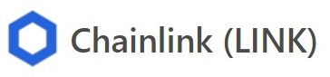

# Smart Gambling: A simple Dapp that allows a user to bet on a random number and win/lose ETH.  

Project #3: This decentralized application (Dapp) allows a user to bet on a random number and win/lose ETH. The frontend is programmed using HTML, JavaScript as well as the [Web3.js - Ethereum JavaScript API](https://web3js.readthedocs.io/). The smart contract is programmed in [Solidity](https://docs.soliditylang.org/) and is designed to run on the [Ethereum](https://ethereum.org/en/) blochchain. The randomness in the game is powered by the decentralized Oracle [ChainLink](https://chain.link/solutions/chainlink-vrf). 

[Chainlink VRF: On-chain Verifiable Randomness](https://blog.chain.link/verifiable-random-functions-vrf-random-number-generation-rng-feature/). 

  

 
 
# Link to play with the Dapp on the [Rinkeby](https://www.rinkeby.io/) testnet.  

[Play the Smart Gambling Dapp](https://fintechcamp.github.io/SmartGambling/). The contract has only been deployed on the [Rinkeby](https://www.rinkeby.io/) testnet.

# Authors:  
- Sebastien Vezina
- Stephen Chen
- Wazarat Hussain
- Valentino De Franco
- Ambreen Simon

## A collapsible section with markdown

  
Click to expand!

  
  ## Heading
  1. A numbered
  2. list
     * With some
     * Sub bullets

