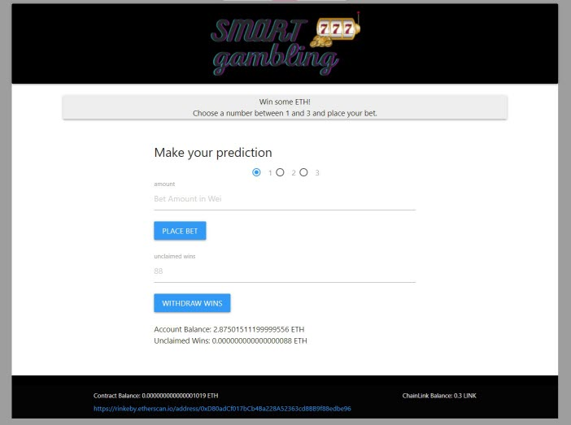

# Smart Gambling: A simple Dapp that allows a user to bet on a random number and win/lose ETH.  

  

Project #3: A Dapp that allows a user to bet on a random number and win/lose ETH.  

### Link to play with the Dapp on the [Rinkeby](https://www.rinkeby.io/) testnet.
[Play the Smart Gambling Dapp](https://fintechcamp.github.io/SmartGambling/)

### Authors:  
- Sebastien Vezina
- Stephen Chen
- Wazarat Hussain
- Valentino De Franco
- Ambreen Simon

## A collapsible section with markdown

  
Click to expand!

  
  ## Heading
  1. A numbered
  2. list
     * With some
     * Sub bullets

